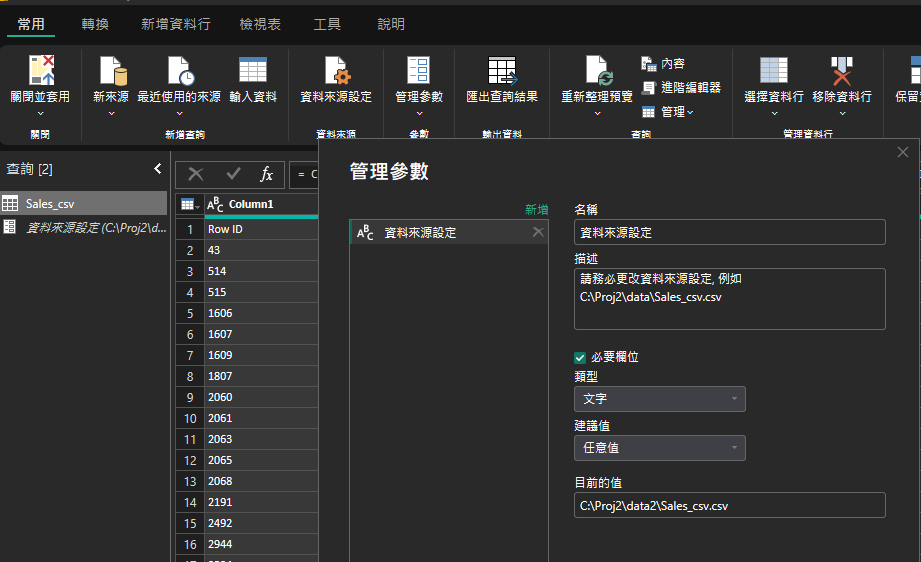
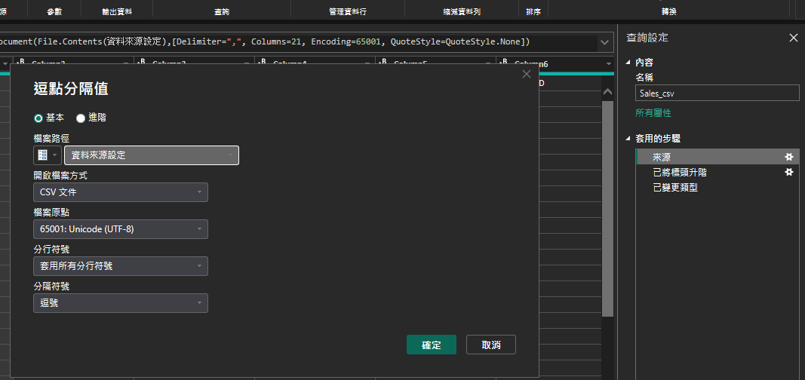

# PBI_work
PBI_work demostration 
# 📊 Power BI 資料來源參數化自動轉換專案

這是一個展示如何利用 **Power BI 參數化 (Parameters)** 功能，實現報表與資料來源彈性掛載的範例專案。透過此設定，使用者無需具備 DAX 或 M Code 基礎，即可輕鬆更新資料路徑。

---

## 📁 檔案清單

| 檔案名稱 | 類型 | 說明 |
| :--- | :--- | :--- |
| `資料來源版本測試.pbit` | Power BI 範本 | 包含報表設計與 Power Query 參數化設定。 |
| `Sales_csv.csv` | 原始資料 | 專案所需的 CSV 格式銷貨資料。 |

---

## 🚀 使用步驟指南

請依照以下 3 個步驟，即可成功在您的本地端運行此報表：

### **Step 1: 檔案下載與準備**
* 下載本倉庫中的 `資料來源版本測試.pbit` 與 `Sales_csv.csv`。
* 將兩個檔案存放在您電腦中的合適路徑。

### **Step 2: 啟動範本檔**
* 雙擊開啟 `資料來源版本測試.pbit`。
* 開啟時，Power BI 會自動跳出 **參數輸入對話框**，詢問您 `Sales_csv.csv` 的儲存路徑。


### **Step 3: 輸入路徑完成轉換**
* 請複製您電腦中 `Sales_csv.csv` 的 **完整檔案路徑**（包含檔名與副檔名）。
* 將路徑貼入輸入框後點擊「載入 (Load)」，報表即會根據該路徑自動完成資料載入。



---

## 🛠️ 技術實作細節

本專案的核心在於 **Power Query 的參數化管理**。以下是設定邏輯，供開發者參考：

### **1. 管理參數設定**
在 Power BI 的「常用」頁籤中，點選 **管理參數 (Manage Parameters)**。我們在此定義了一個名為 `SourcePath` 的文字型參數。



### **2. 動態連結資料來源**
在 Power Query 編輯器內，我們將「來源」步驟的路徑固定值，改為引用剛剛設定的參數：

```powerquery
let
    Source = Csv.Document(File.Contents(SourcePathParameter),[Delimiter=",", Columns=5, Encoding=65001, QuoteStyle=QuoteStyle.None])
in
    Source
